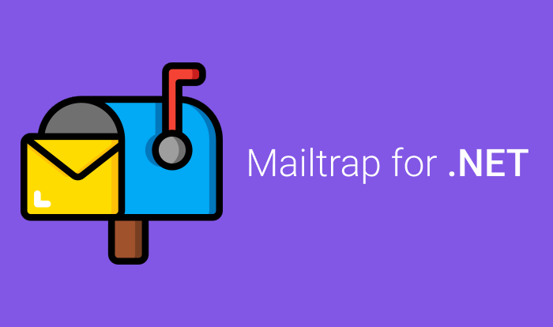

<p align="center">
  <a href="#-technologies">Technologies</a>&nbsp;&nbsp;&nbsp;|&nbsp;&nbsp;&nbsp;
  <a href="#-project">Project</a>&nbsp;&nbsp;&nbsp;|&nbsp;&nbsp;&nbsp;
  <a href="#-services">Services</a>&nbsp;&nbsp;&nbsp;|&nbsp;&nbsp;&nbsp;
  <a href="#-license">License</a>
</p>

<p align="center">
  <a href="https://www.nuget.org/packages/Mailtrap/" target="_blank"></a>
  <a href="https://www.nuget.org/packages/Mailtrap/" target="_blank"></a>
  <a href="https://github.com/flaviodamaiajr/mailtrap/pulls"></a>
  <a href="#-license"></a>
<p>

<br>

<p align="center">
  
</p>

## 💻 Project

The main idea of this project is to facilitate tests using the Mailtrap Sandbox Service during the development of features that use email sending (for .NET only).

## 🚀 Technologies

This project is being developed with the following technologies:

- <a href="https://docs.microsoft.com/en-us/dotnet/standard/net-standard?tabs=net-standard-2-1" alt=".NET Standard" target="_blank">.NET Standard 2.1</a>
- <a href="https://docs.microsoft.com/en-us/aspnet/core/release-notes/aspnetcore-6.0?view=aspnetcore-6.0" alt=".NET Core 6.0" target="_blank">.NET Core 6.0</a>
- <a href="https://nunit.org/" alt="NUnit" target="_blank">NUnit 🧪</a>

## 🤝 Services

- <a href="https://mailtrap.io/" alt="Mailtrap - Email Sandbox Service" target="_blank">Mailtrap - Email Sandbox Service</a>

## ℹ️ Requirements

It's necessary create an account on Mailtrap.io to use this library.

## 👨‍💻 How to use

### Add package

It's possible to add using .NET CLI or Package Manager.

#### .NET CLI

```
dotnet add package Mailtrap
```

#### Package Manager

```
PM> Install-Package Mailtrap
```

Check other alternatives on <a href="https://www.nuget.org/packages/Mailtrap/">NuGet.org</a>

### Sample Code

```csharp
using Mailtrap.Source.Models;

var mailtrap = new MailtrapSender("your username", "your password");

var email = new Email(
    "to@mailtrap.io",
    "from@mailtrap.io",
    "Sending e-mail test using Mailtrap for .NET 📬",
    "Ahoooy! It really works! 😎");

mailtrap.Send(email);
```

###For More datails on Wiki

## 📝 License

This project is under the MIT license. See the file [LICENSE](LICENSE) for more details.
